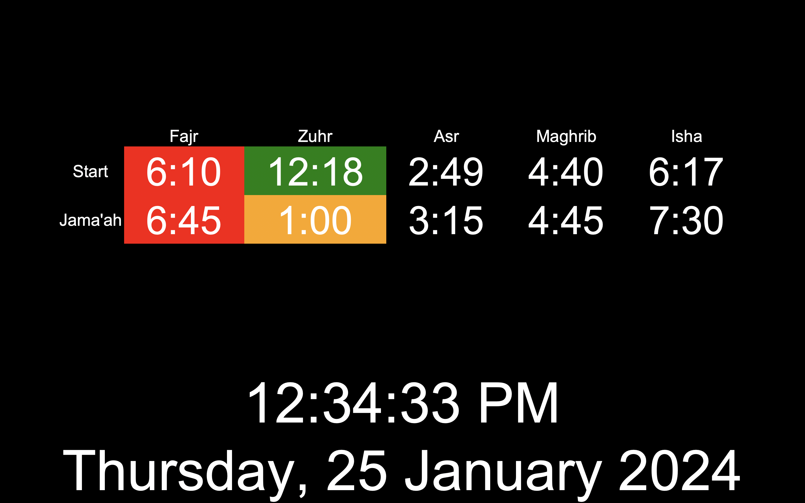

[![Portfolio][portfolio-shield]][portfolio-url]

 

  <h3 align="center">Home Dashboard</h3>
  

    An Information Board at Home
  

<!-- ABOUT THE PROJECT -->

## About The Project

### Purpose of project

The project aims to replicate a digital signage system typically used in advertising. Instead of displaying ads, it intends to be used as an household information communication system.
In simple terms its an information board used at home. The information displayed include prayer times, weather updates, date, time and notes.

This is a personal project which is being used at home and relatives homes providing valuable information to my family and me.

### Built With

- [![Python][Python]][Python-url]

<!-- MARKDOWN LINKS & IMAGES -->
<!-- https://www.markdownguide.org/basic-syntax/#reference-style-links -->

[portfolio-shield]: https://img.shields.io/badge/Portfolio-000?style=for-the-badge&logo=web&logoColor=white
[portfolio-url]: https://habibabdulwahid.com/
[Python]: https://img.shields.io/badge/Python-3776AB?style=for-the-badge&logo=python&logoColor=white
[Python-url]: https://www.python.org/
